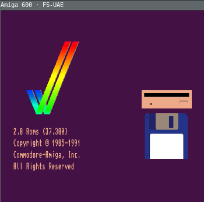

# Docker FS-UAE

[Amiga](https://en.wikipedia.org/wiki/Amiga) emulation with [FS-UAE](http://fs-uae.net/) running under Docker.



## Prerequisites

If you want to do anything useful with this image, you'll Amiga Kickstart ROMs. The FS-UAE site [explains this in more detail](http://fs-uae.net/kickstarts).  

## Starting a FS-UAE container

```
docker run -it \
   -e DISPLAY=$DISPLAY \
   -v /tmp/.X11-unix:/tmp/.X11-unix \
   -v $HOME/.config/fs-uae/:/home/fsuae/config
   --device /dev/dri/card0 \
   --device /dev/snd \
   --name fs-uae \
   jamesnetherton/fs-uae
```

The default `ENTRYPOINT` is `fs-uae --base-dir=/home/fsuae/config` which enables you to mount and share a configuration volume.

Using the example above, when a container is launched for the first time it will populate $HOME/.config/fs-uae with directories where you can store your FS-UAE configuration, Kickstart ROMs, games etc.

## FS-UAE configuration

As per the example above, you can share configuration directories with FS-UAE by using the `-v` switch and mapping a directory on your host to `/home/fsuae/config` within the container.

### Configuration files

You can create [FS-UAE configuration files](http://fs-uae.net/configuration-files) and place them into `$HOME/.config/fs-uae/Configurations`.

### kickstarts

Note the above prerequisites around Kickstarts.

Once you have obtained Kickstart ROMs you can copy them into `$HOME/.config/fs-uae/Kickstarts`

### Games

Place [floppy disk images](http://fs-uae.net/floppy-images) into `$HOME/.config/fs-uae/Floppies`. Your FS-UAE configuration should reference the images like `floppy_drive_0 = CannonFodder1.adf`.

Alternatively there is the option of using [hard drives](http://fs-uae.net/using-hard-drives).

### Overriding configuration options

All [options](http://fs-uae.net/options) within the configuration file can be overriden using command line flags. For example.

** Load a floppy image **

```
docker run -it \
   -e DISPLAY=$DISPLAY \
   -v /tmp/.X11-unix:/tmp/.X11-unix \
   -v $HOME/.config/fs-uae/:/home/fsuae/config
   --device /dev/dri/card0 \
   --device /dev/snd \
   --name fs-uae \
   jamesnetherton/fs-uae --floppy-drive-0=CannonFodder1.adf
```

** Run full screen **

```
docker run -it \
   -e DISPLAY=$DISPLAY \
   -v /tmp/.X11-unix:/tmp/.X11-unix \
   -v $HOME/.config/fs-uae/:/home/fsuae/config
   --device /dev/dri/card0 \
   --device /dev/snd \
   --name fs-uae \
   jamesnetherton/fs-uae --fullscreen
```
