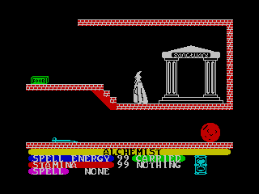

# Fuse Spectrum Emulator on Docker

[ZX Spectrum](https://en.wikipedia.org/wiki/ZX_Spectrum) emulation with [Fuse](http://fuse-emulator.sourceforge.net/) running under Docker.



## Starting a Fuse container

```
docker run -it \
   -e DISPLAY=$DISPLAY \
   -v /tmp/.X11-unix:/tmp/.X11-unix \
   --device /dev/dri/card0 \
   --device /dev/snd \
   --name fuse-emulator \
   jamesnetherton/fuse-emulator
```

### Games

You'll need some .tap or .tzx files to play games. You can mount a directory from your host into the container to share downloaded games.

The [World Of Spectrum Archive](http://www.worldofspectrum.org/archive.html) is a good place to find games. 

